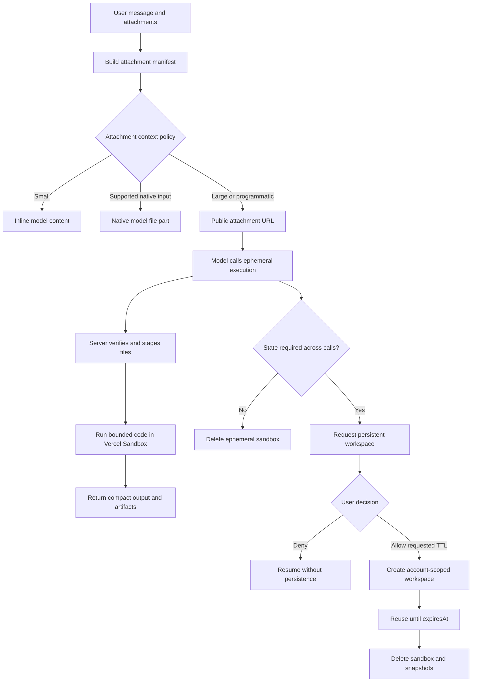

# Code Execution Architecture

## Purpose

SilkChat will use Vercel Sandbox to execute model-generated JavaScript and Python, inspect large attachments programmatically, and return compact answers or generated artifacts without placing entire source files in model context.

The product rule is **ephemeral first**. A normal execution receives a fresh, non-persistent sandbox and is deleted after the call. If a task genuinely needs filesystem state across multiple tool calls, the assistant may request a short-lived persistent workspace with the shortest sufficient time-to-live (TTL) between 3 and 30 minutes. The user must approve that exact request.

Once a persistent workspace is active, it becomes the account's exclusive code-execution environment until killed or expired. The server routes compatible executions to it even if the model omits `sandboxMode` or asks for `ephemeral`. A mismatched runtime is rejected rather than escaping into a new ephemeral sandbox.

The model should call the budget-exempt `release_persistent_sandbox` control tool after it has returned all required results and no follow-up execution is needed. Independently, an activity lease suspends the Vercel session after 90 seconds without a command; the next execution resumes the persistent filesystem without extending its hard TTL.

Sandbox billing uses Vercel's published Pro rates. Persistent workspace approval reserves a worst-case compute amount for the selected TTL, then cleanup settles the reservation to measured provider usage in microdollars.

## Product principles

1. **Do not spend context on bulk data.** Files above the context threshold are represented by a compact manifest and inspected with code.
2. **Do not make storage mechanics part of the UI.** Long pasted text and ordinary eligible attachments share one attachment area even though their model-delivery routes may differ.
3. **Do not grant persistence silently.** Persistent state is an explicit, time-bounded capability escalation.
4. **Do not trust model-provided resource identifiers.** The server resolves user, thread, attachment, and sandbox ownership.
5. **Bound every resource.** Code size, dependencies, runtime, output, file transfer, concurrency, and retained state all have enforced limits.
6. **Prefer recoverable results.** Tool failures should be structured so the model can make one meaningful correction without creating loops.

## High-level flow



## Attachment context policy

Attachment presentation and model delivery are separate decisions.

### Pasted text

The first implementation uses the existing client-side `estimateTokenCount` helper and one token threshold:

- Up to `LONG_ATTACHMENT_REFERENCE_TOKEN_THRESHOLD`: leave the paste in the textarea and send it directly in model context, without a chip.
- Above the long-attachment threshold: create a `Pasted Text N.txt` attachment chip, upload the content, and route it to the model as a scoped URL/reference that must be inspected with code execution.

The current threshold is 16,000 estimated tokens. It is a policy constant and can be tuned from real usage.

URL references are emitted only when code execution is enabled and the selected model supports function calling. Without that route, text remains inline up to the former 32,000-token ceiling; larger text is withheld with a model-visible instruction to ask the user to enable execution or select a capable model.

The upload token ceiling is separate from this context threshold. It is raised from 32,000 to 8,000,000 estimated tokens as a final abuse guard, leaving the existing 15 MB byte limit as the practical upload ceiling. A file being uploadable does not make it eligible for direct model context.

The URL-backed case renders as `Pasted Text N`. Upload progress and the backing URL are implementation details. The chip offers **Show as text**. Selecting it:

- aborts an in-flight upload when possible;
- removes the local attachment state;
- deletes an already uploaded object;
- inserts the original text at the current end of the composer draft; and
- restores focus to the textarea.

The client classification improves immediate UX, but the server remains authoritative. It must recompute the delivery class from trusted attachment metadata or content before building model messages.

### Local draft lifecycle

Composer drafts are stored in a versioned local registry keyed by thread. New chats use separate root and folder-scoped keys until their first message creates a thread. Each draft contains textarea content and uploaded attachment metadata, allowing both to survive refreshes without uploading the same object again. Draft writes are debounced and deduplicated, and uploaded paste metadata omits the original large source string to keep local persistence off the composer hot path.

Submitting clears the local draft without deleting its attachments because they have become part of the message. Deleting a thread cascades through its draft and queues any draft-only attachment objects for deletion. Deleting a folder and its threads can cascade by folder and explicit thread IDs; archiving a non-empty folder retains its drafts. Failed object deletions remain in a local retry queue and are retried when the sidebar next initializes or another cascade runs.

### Eligible regular attachments

The same long-attachment routing area will coalesce ordinary eligible uploads with pasted-text attachments. The targeted formats are:

- plain text and Markdown;
- source code and structured text such as JSON, YAML, XML, and SQL; and
- spreadsheets and tabular datasets such as CSV, TSV, XLSX, and Parquet.

Images and PDFs are explicitly excluded from this policy. Images remain on the existing vision/reference-image path. PDFs remain on the existing native-PDF path and are not converted into code-execution URLs as part of this sprint.

### Attachment manifest

Large eligible attachments should appear in model context as a small manifest containing:

- the existing public R2 asset URL;
- display filename and media type;
- byte size and estimated token count when known;
- whether native model input is available; and
- an instruction to inspect it programmatically and not print the whole file.

Do not introduce signed or presigned URLs for this flow. Tool input must never accept a Vercel sandbox name.

### Supported data formats

The first data-oriented expansion should add CSV, TSV, XLSX, Parquet, SQLite, and bounded archives. Archives require compressed-size, expanded-size, entry-count, nesting, and path-traversal protections. The existing 15 MB upload limit remains until cost and latency measurements justify a change.

## Ephemeral execution

An ephemeral call creates a sandbox with `persistent: false`, stages the selected attachments and script, executes it, captures bounded output, records usage, and permanently deletes the sandbox.

### Tool contract

`execute_code` should evolve toward:

```ts
{
    language: "javascript" | "python"
    code: string
    dependencies?: string[]
    attachmentUrls?: string[]
    timeoutMs?: number
    network?: "none" | "public"
}
```

The model receives only URLs selected from the current message/thread attachment manifest. The server rejects arbitrary local paths and URLs that are not part of that manifest. Files are staged under a generated workspace directory and a safe path map is returned to the execution wrapper.

### Network policy

Use the least-capable policy that completes the task:

1. Allow approved package registries and the attachment source during setup.
2. Stage dependencies and inputs.
3. Change the sandbox firewall before running model-generated code.
4. Default to no network for private-data analysis.
5. Retain public network access only for tasks that require live retrieval.

No SilkChat, database, model-provider, or storage credentials are placed in the sandbox environment. Long attachments use the existing public R2 asset URL; no signed-URL mechanism is added.

### Output and artifacts

Output is a combined bounded budget, collected while streaming rather than fetched fully and truncated afterward. The result includes exit status, duration, truncation status, and a small stdout/stderr payload. Scripts that produce large or binary results write artifacts; SilkChat uploads those artifacts and returns attachment handles instead of model-context bytes.

Each execution receives a unique directory through `SILKCHAT_ARTIFACT_DIR`. Files written beneath it are treated as untrusted staging output and are exported before the sandbox is stopped, deleted, suspended, or released. Persistent workspaces receive a fresh directory for every call so files from an earlier execution are never republished implicitly.

The export bridge:

1. walks only that execution's output directory, with bounded depth and entry count;
2. rejects links, non-regular files, unsupported formats, invalid signatures, and files outside the size budgets;
3. uploads accepted bytes to the dedicated `code-artifacts/{userId}/` R2 namespace;
4. returns compact artifact metadata and a direct public R2 URL to the model rather than file bytes; and
5. projects that metadata into ordinary assistant `file` parts for durable download and message replay.

The initial limits are five files per execution, 15 MB per file, and 25 MB total. Supported outputs are PDF, CSV/TSV, JSON and text formats, XLSX/DOCX/PPTX, ZIP, SQLite, Parquet, PNG, JPEG, and WebP. Active document formats such as HTML and SVG are not exported. No signed URL mechanism is introduced.

The assistant should normally refer to the automatically attached file by filename. If it emits a Markdown link, it must use the returned HTTPS URL exactly. Sandbox-local and `file:` URLs are never user-facing and remain blocked by the Markdown renderer.

Before deletion, stop the sandbox and record active CPU, per-session provisioned memory duration, ingress, egress, snapshot byte-duration, session count, runtime, VCPU count, and creation outcome. Convert those provider metrics to microdollars before deleting the sandbox and settling its usage reservation.

### Billing policy

Persistent approval reserves against the requested TTL using the fixed 1-vCPU/2-GB shape. The reservation assumes 100% active CPU and provisioned memory for the full TTL plus one sandbox creation. This is the maximum compute exposure implied by the request; network and snapshot usage are not TTL-bounded and are therefore settled from actual metrics instead of guessed into the reservation.

At final cleanup, SilkChat stops the current session, enumerates all sessions and snapshots, and calculates:

- active CPU at the published per-hour rate;
- provisioned memory at the per-GB-hour rate, with Vercel's one-minute minimum per session;
- ingress plus egress at the data-transfer rate;
- snapshot byte-duration at the GB-month rate; and
- one creation charge.

The resulting amount is rounded once to integer microdollars. Provider rates have environment overrides so a Vercel pricing change does not require a code deploy. If final metrics cannot be retrieved, the conservative reserved amount is settled rather than silently releasing consumed infrastructure usage.

Ephemeral calls continue to reserve the bounded per-call tool estimate before execution, but that provisional event is reconciled immediately after the VM stops using the same measured-cost calculator. Executions routed into a persistent workspace settle their per-call event to zero because their provider usage is accounted for by the workspace lifecycle reservation.

## Persistent workspaces

Persistence is requested through a separate approval-gated tool:

```ts
request_persistent_sandbox({
    ttlMinutes: 3 | 5 | 10 | 15 | 30,
    purpose: string,
    runtime: "node24" | "python3.13"
})
```

The tool produces a SilkChat-specific Allow/Deny card and stops the assistant turn. Approval atomically claims the account-wide slot and starts the TTL; denial is recorded in the card result. Unanswered confirmation cards expire after ten minutes. The assistant must not repeat the same request without materially changed circumstances. Automatic assistant continuation after approval is a follow-up enhancement; until then, the user can continue the conversation after the workspace becomes active.

### Ownership and lifecycle

Initially, allow one active workspace per account across all threads. The model does not receive or submit its Vercel name. SilkChat resolves the active workspace from authenticated account context. Both the originating card and the composer expose a manual kill control.

Convex stores:

- internal workspace ID;
- server-generated Vercel sandbox name;
- account ownership and originating thread/message/card identifiers;
- status (`provisioning`, `active`, `stopping`, `stopped`, `expired`, `failed`, or `denied`);
- requested TTL and authoritative `expiresAt`;
- runtime and resource configuration;
- latest provider usage totals; and
- cleanup attempt metadata.

Vercel `timeout` limits a running session. It does not replace `expiresAt`, because persistent filesystem snapshots have an independent lifetime. At approval, set the session timeout to the remaining TTL, retain only the latest snapshot, and schedule an internal cleanup at `expiresAt`. A one-minute reconciliation job queries the lifecycle table for expired, stuck-stopping, stale-provisioning, or unconditionally over-30-minute records and deletes resources missed by scheduled cleanup. A separate five-minute provider sweep lists Vercel sandboxes bearing the exact SilkChat persistent-workspace tags and deletes every persistent provider resource older than 30 minutes, including orphans whose database write never completed.

Cleanup must also run when a thread or account is deleted.

## Security boundaries

- Code execution requires an authenticated account; anonymous sessions never receive the tool.
- Revalidate attachment ownership immediately before staging.
- Never accept raw R2 keys, sandbox names, snapshot IDs, environment variables, or credentials from tool input.
- Sanitize staged filenames and prevent path traversal and symlink escapes.
- Serialize execution within one persistent workspace until concurrent command semantics are explicitly designed.
- Treat attachment content as untrusted and susceptible to prompt injection.
- Enforce expiry before every provider call, not only in the cleanup job.
- Cap output at collection time and reject unexpected artifact count or size.
- Tag resources with non-sensitive internal identifiers; do not place raw user data in Vercel tags.

## Observability and provisional billing

Record an execution event for every attempted call, including failed provisioning and dependency installation. Event fields should distinguish ephemeral and persistent sessions and include provider-reported CPU/network metrics when available.

The UI can continue using the provisional flat credit reservation while the feature is experimental. Settlement should later use measured cost plus a documented margin, with a hard per-user spend and concurrency ceiling independent of credit balance.

## Delivery phases

### Phase 1 — Pasted-text UX

- Classify plain-text paste as inline or an execution-backed URL at 16,000 estimated tokens.
- Render the URL-backed paste in the normal attachment area.
- Support converting a pasted attachment back into textarea content.
- Abort or delete the backing upload during conversion.
- Add focused tests for classification and draft merging.

### Phase 2 — Long-attachment routing

- Persist trusted token/size metadata.
- Add the attachment manifest to model context.
- Pass validated attachment URLs to execution.
- Stage files server-side and add dataset formats.
- Update context estimation so referenced files pay only the manifest-token cost.

### Phase 3 — Execution hardening

- Replace command timeout fields with abort signals supported by the installed SDK.
- Stream into a combined output cap.
- Add network-policy staging and artifact upload.
- Capture Vercel usage before deletion and settle persistent reservations to measured cost.
- Add provider lifecycle integration tests.

### Phase 4 — Approval and persistence

- Preserve AI SDK approval request/response parts through stream persistence.
- Build the persistent-workspace confirmation card.
- Add the Convex lifecycle table, idempotent provisioning, scheduled deletion, and reconciliation cron.
- Auto-continue the assistant after Allow or Deny.

### Phase 5 — Performance and billing

- Create prewarmed data-analysis snapshots or custom images.
- Evaluate sandbox forks for isolated prepared environments.
- Measure creation, package installation, attachment transfer, and execution latency.

## Non-goals for the first release

- Arbitrary shell access as a model-facing tool.
- User-selectable sandbox identifiers.
- Long-lived development environments.
- Vercel Drives, exposed ports, or live app previews.
- Indefinite persistence or persistence shared between threads.
- Finalized customer billing.

## Acceptance criteria for the sprint

- Large supported attachments no longer enter model context in full.
- The model can inspect them without receiving storage credentials.
- Code calls use ephemeral sandboxes unless an approved persistent workspace is active; while active, all compatible calls route through it.
- Persistent workspaces cannot exist without recorded approval and expire within the selected TTL.
- Users see one consistent attachment UI regardless of model delivery strategy.
- Output and provider spend are bounded and observable.
- Failure, denial, expiry, retry, and cleanup paths are covered by focused state-transition tests.
